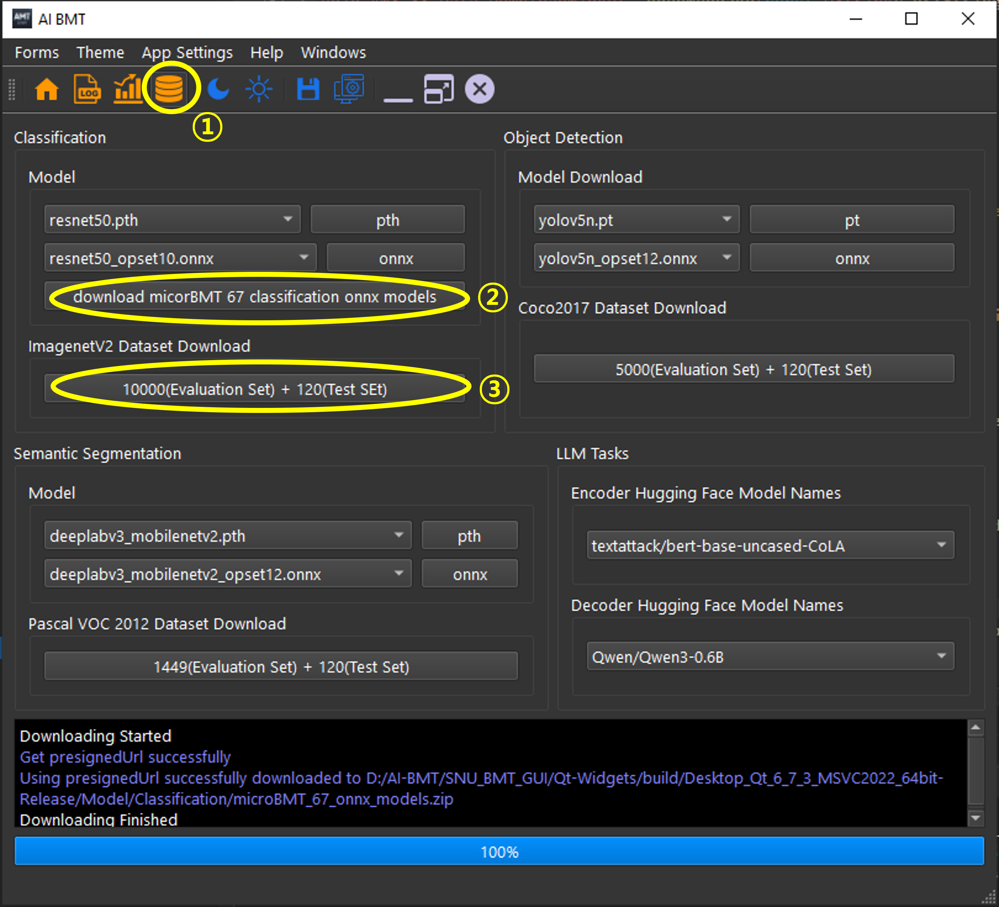

# AI-MicroBMT: Reproducibility Artifacts

**Companion code for the paper:**  
> *AI-MicroBMT: A Micro-Benchmark Toolkit for Evaluating Edge AI Accelerator Deployment*  
> KDD 2026 — Dataset & Benchmark Track

This repository contains the complete pipeline to **reproduce all scores, rankings, and figures** presented in the paper. It is organized in two parts:

1. **UDS Scoring** — computes the Unified Deployment Score (S1–S7) and weighted rankings from raw benchmark CSVs.
2. **Analysis & Visualization** — generates all charts, heatmaps, and LaTeX tables appearing in the paper.

---

## Table of Contents

- [Requirements](#requirements)
- [Evaluation Guide — Raw Data Collection](#evaluation-guide--raw-data-collection)
- [Quick Start](#quick-start)
- [Repository Structure](#repository-structure)
- [Part 1 — UDS Scoring Pipeline](#part-1--uds-scoring-pipeline)
  - [Sub-Scores (S1–S7)](#sub-scores-s1s7)
  - [Input Data Format](#input-data-format)
  - [Configuration (Scoring)](#configuration-scoring)
  - [Output Files (Scoring)](#output-files-scoring)
- [Part 2 — Analysis & Visualization](#part-2--analysis--visualization)
  - [Configuration (Analysis)](#configuration-analysis)
  - [Output Files (Analysis)](#output-files-analysis)
- [Customization Guide](#customization-guide)
  - [Adding a New Device](#adding-a-new-device)
  - [Adding a New Model Family](#adding-a-new-model-family)
  - [Defining Weight Profiles](#defining-weight-profiles)
  - [Tuning Feasibility Gate Parameters](#tuning-feasibility-gate-parameters)
  - [Analysis Config Reference](#analysis-config-reference)
- [Example End-to-End Workflow](#example-end-to-end-workflow)
- [License](#license)

---

## Requirements

```
python >= 3.8
pandas
numpy
matplotlib
seaborn
```

```bash
pip install pandas numpy matplotlib seaborn
```

---

## Evaluation Guide — Raw Data Collection

Before running any analysis scripts, you must first **collect raw benchmark data** by evaluating your target devices with the AI-BMT program. Follow the steps below.

### Step 0 — Download the AI-BMT Program

1. Visit **[https://www.ai-bmt.com/](https://www.ai-bmt.com/)** and download the **User Manual**.
   - Alternatively, access the manual directly from [https://github.com/kinsingo/SNU_BMT_DOCX](https://github.com/kinsingo/SNU_BMT_DOCX).
2. Refer to the manual and download the **AI-BMT application** that matches your evaluation environment:
   - **Architecture**: x64 / ARM64
   - **OS**: Windows, Linux, or macOS
3. Install and launch the AI-BMT program.

### Step 1 — Download Models & Datasets

Open the AI-BMT application and navigate to the **Data Download** tab, then download the required models and datasets as shown below:



| # | Action | Description |
|---|--------|-------------|
| ① | **Go to the Data Download tab** | Click the database icon in the toolbar to open the download page |
| ② | **Download 67 MicroBMT classification ONNX models** | Click the download button under the Classification section to fetch all 67 benchmark models |
| ③ | **Download the ImageNet V2 dataset** | Downloads 10,000 evaluation images + 120 test images for classification benchmarking |

> **Tip**: Repeat for other task types (Object Detection, Semantic Segmentation, LLM Tasks) if your evaluation scope extends beyond classification.

### Step 2 — Run Benchmarks on Your Devices

1. Follow the User Manual instructions to configure and execute benchmarks on each target device.
2. Your evaluation data will be **automatically uploaded** to the server once each evaluation is finished. You can then **download the results as CSV** from the database — either through the AI-BMT application or the web interface (refer to the User Manual for details).
3. Organize the downloaded CSVs into the folder structure expected by the analysis pipeline (see [Repository Structure](#repository-structure)).

### Reference: Accelerator Evaluation Scripts

The `accelerator_AIBMT_evalution_scripts/` folder contains **C++ based example evaluation scripts** for the hardware platforms used in the paper:

```
accelelerator_AIBMT_evalution_scripts/
├── Apple M4 (CPU/ANE)/
├── DeepX M1/
├── Hailo-8/
├── Mobilint-ARIES/
├── RTX PRO 6000 Max-Q/
└── Rubic pi 3 (QCS6490)/
```

Use these scripts as reference when integrating a new accelerator into the benchmark pipeline.

---

## Quick Start

```bash
# --- Part 1: UDS Scoring ---
python "1. Create UDS Scores.py"   # Compute sub-scores S1~S7
python "2. UDS cases.py"           # Weighted rankings for 16 use-case profiles

# --- Part 2: Analysis & Visualization ---
python analyze_results_singleStream_offline.py
python analyze_activation_sweep.py
python analyze_results_input_resolution_singleStream.py
python analyze_results_input_resolution_offline.py
python generate_cases_analysis.py
```

---

## Repository Structure

```
.
├── 1. Create UDS Scores.py                        # Step 1: sub-score calculation
├── 2. UDS cases.py                                # Step 2: weighted UDS rankings
├── analysis_config.py                             # Centralized config for analysis scripts
├── utils.py                                       # Shared utilities (data loading, normalization)
├── analyze_results_singleStream_offline.py        # Radar charts + accuracy drop heatmap
├── analyze_activation_sweep.py                    # Activation function support/performance
├── analyze_results_input_resolution_singleStream.py  # Resolution vs latency analysis
├── analyze_results_input_resolution_offline.py    # Resolution vs offline throughput
├── generate_cases_analysis.py                     # Case classification (1–4) + LaTeX tables
│
├── <model_family> variant/                        # Raw benchmark CSVs per model family
│   ├── <model_family> variant single-stream results.csv
│   └── <model_family> variant offline results.csv
├── input resolution variant/                      # Resolution-sweep CSVs
│   ├── input_variant_singleStream.csv
│   └── input_variant_offline.csv
│
├── UDS_scores_summary.csv                         # Output: per-device S1~S7
├── UDS_cases_results.csv                          # Output: full rankings
├── UDS_cases_winners.csv                          # Output: winner per profile
├── UDS_weight_profiles.csv                        # Output: weight definitions
│
└── analysis_charts/                               # Output: charts & CSV summaries
    ├── activation_sweep/
    ├── singleStream_vs_offline/
    ├── inputResolution_singleStream/
    └── inputResolution_offline/
```

---

## Part 1 — UDS Scoring Pipeline

| Step | Script | Description |
|------|--------|-------------|
| 1 | `1. Create UDS Scores.py` | Computes 7 individual sub-scores (S1–S7) from raw benchmark data |
| 2 | `2. UDS cases.py` | Applies user-defined weight profiles to produce weighted UDS rankings |

### Sub-Scores (S1–S7)

| Score | Name | Description | Data Source |
|-------|------|-------------|-------------|
| S1 | Coverage | Fraction of models that pass the feasibility gate | Base Suite |
| S2 | Efficiency | Average latency speedup vs. CPU baseline (log-scaled) | Base Suite |
| S3 | Scaling | Resolution-robust scaling ability across input sizes | Resolution Sweep |
| S4 | Accuracy Retention | How well accuracy is preserved after quantization/compilation | Base Suite |
| S5 | Throughput Gain | Offline throughput improvement vs. CPU (log-scaled) | Base Suite |
| S6 | Peak Compute Efficiency | Throughput normalized by vendor-reported peak TOPS (optional) | Base Suite |
| S7 | Power Efficiency | Throughput normalized by device power consumption (optional) | Base Suite |

### Input Data Format

#### Single-Stream CSV (latency measurement)

| Column | Type | Description |
|--------|------|-------------|
| `task` | str | Task name (e.g., "Image Classification") |
| `scenario` | str | Must be "Single-Stream" |
| `accuracy` | float | Model accuracy (%) on the device |
| `sample_latency_average` | float | Average inference latency (ms) |
| `accelerator_type` | str | Device name (e.g., "Hailo-8", "Apple M4 CPU") |
| `benchmark_model` | str | Model variant name (e.g., "mobilenetv2_w1_0") |

#### Offline CSV (throughput measurement)

| Column | Type | Description |
|--------|------|-------------|
| `task` | str | Task name (e.g., "Image Classification") |
| `scenario` | str | Must be "Offline" |
| `accuracy` | float | Model accuracy (%) on the device |
| `samples_per_second` | float | Throughput (samples/sec) |
| `accelerator_type` | str | Device name |
| `benchmark_model` | str | Model variant name |

#### Resolution Sweep CSV (additional column)

Same format as above, plus:

| Column | Type | Description |
|--------|------|-------------|
| `input_resolution` | str | Format: `inputResolution:<size>` (e.g., `inputResolution:224`) |

> **Note**: One device must serve as the **CPU baseline** (default: `Apple M4 CPU`). This device's results are used to compute relative accuracy drops and speedups.

### Configuration (Scoring)

Open `1. Create UDS Scores.py` and locate the **USER-CONFIGURABLE PARAMETERS** section near the top.

**Feasibility Gate:**

```python
TAU_ACC = 4.0       # Max tolerable accuracy drop (%) from CPU baseline
THETA_SPEEDUP = 1.0 # Min required speedup vs CPU (1.0 = at least as fast)
A_MIN = 15.0        # Min absolute accuracy (%) to avoid silent failures
```

**Data Folders:**

```python
DATA_FOLDERS_BASE = [
    'densenet variant',
    'convnext variant',
    'mobilenet variant',
    # ... add your model variant folders here
]
DATA_FOLDERS_RES = ['input resolution variant']
```

**Hardware Specs (for S6 & S7):**

```python
HARDWARE_POWER = {
    'DeepX M1': 5.0,
    'Hailo-8': 8.65,
    'Your-Device': 10.0,       # <-- Add your device
    'Apple M4 CPU': None,       # SoC: not separately measurable
}
HARDWARE_PEAK_COMPUTE = {
    'DeepX M1': 25.0,
    'Hailo-8': 26.0,
    'Your-Device': 50.0,       # <-- Add your device
    'Apple M4 CPU': None,
}
```

Devices with `None` will have S6/S7 = N/A (excluded from extended UDS profiles).

### Output Files (Scoring)

| File | Description |
|------|-------------|
| `UDS_scores_summary.csv` | Per-device sub-scores S1–S7 with metadata (input for Step 2) |
| `UDS_scores_detailed_base.csv` | Per-task metrics for the base suite |
| `UDS_scores_detailed_resolution.csv` | Per-task metrics for the resolution sweep |
| `UDS_cases_results.csv` | Full device rankings for every weight profile |
| `UDS_cases_winners.csv` | Winner (rank 1) device per weight profile |
| `UDS_weight_profiles.csv` | Weight definitions for all profiles |

---

## Part 2 — Analysis & Visualization

All visualization scripts read settings from a single centralized file:

| File | Description |
|------|-------------|
| `analysis_config.py` | **All user-configurable settings** — edit this file only |
| `utils.py` | Shared utilities (data loading, model name normalization, color palette) |
| `analyze_results_singleStream_offline.py` | Radar charts (3 scalings) + accuracy drop heatmap |
| `analyze_activation_sweep.py` | Activation function support/performance analysis |
| `analyze_results_input_resolution_singleStream.py` | Input resolution vs. latency analysis |
| `analyze_results_input_resolution_offline.py` | Input resolution vs. offline throughput analysis |
| `generate_cases_analysis.py` | Case classification (1–4) + LaTeX table generation |

### Configuration (Analysis)

All settings live in `analysis_config.py`. Edit only that file when adapting the analysis to new data.

See the [Analysis Config Reference](#analysis-config-reference) section below for details.

### Output Files (Analysis)

```
analysis_charts/
├── activation_sweep/
│   ├── combined_accuracy_analysis.png
│   ├── activation_latency_comparison.png
│   ├── activation_speedup_comparison.png
│   ├── activation_recommendations.png
│   └── *.csv  (degradation, latency, speedup, recommendations)
├── singleStream_vs_offline/
│   ├── combined_radar_chart_*.png  (linear, sqrt, log10)
│   ├── accuracy_drop_heatmap.png
│   └── *.csv  (throughput, heatmap data)
├── inputResolution_singleStream/
│   ├── resolution_vs_latency_by_model.png
│   ├── latency_scaling_analysis_3_models.png
│   └── *.csv  (scaling analysis, key statistics)
└── inputResolution_offline/
    ├── singlestream_vs_offline_throughput.png
    ├── multicore_efficiency_by_resolution_3_models.png
    └── *.csv  (summary, efficiency data)
```

---

## Customization Guide

### Adding a New Device

1. In `1. Create UDS Scores.py`:
   - Add to `HARDWARE_POWER` and `HARDWARE_PEAK_COMPUTE` (set `None` if unknown)
2. In `analysis_config.py`:
   - Add to `ALL_ACCELERATORS` (order = chart display order)
   - Add a color entry to `ACCELERATOR_COLORS`
   - If the device is an NPU, it will be auto-derived from `ALL_ACCELERATORS` minus `BASELINE_DEVICE`

### Adding a New Model Family

1. Create a folder (e.g., `efficientnet variant/`) containing:
   - `efficientnet variant single-stream results.csv`
   - `efficientnet variant offline results.csv`
2. In `1. Create UDS Scores.py`: add `'efficientnet variant'` to `DATA_FOLDERS_BASE`
3. In `analysis_config.py`: add an entry to `DATA_FOLDERS`

### Defining Weight Profiles

In `2. UDS cases.py`:

```python
# UDS Basic profiles (S1~S5 only, weights must sum to 1.0)
UDS_profiles = {
    "UDS_AccuracyStrict": {"S1":0.15, "S2":0.20, "S3":0.15, "S4":0.30, "S5":0.20},
    "UDS_LatencyFirst":   {"S1":0.15, "S2":0.30, "S3":0.15, "S4":0.20, "S5":0.20},
    "My_Custom_Profile":  {"S1":0.10, "S2":0.10, "S3":0.10, "S4":0.40, "S5":0.30},
}

# UDS Extended profiles (S1~S7, weights must sum to 1.0)
EXT_profiles = {
    "EXT_AccStrict_Both": {"S1":0.13,"S2":0.13,"S3":0.13,"S4":0.18,"S5":0.13,"S6":0.15,"S7":0.15},
}
```

> **Rule**: All weights within a profile must sum to **1.0**.

Profiles with `_with_fixed_inputRes` suffix set `S3 = 0` (useful when only a single resolution is benchmarked).

### Tuning Feasibility Gate Parameters

| Parameter | Default | Effect |
|-----------|---------|--------|
| `TAU_ACC` | 4.0 | Max tolerable accuracy drop (%) from CPU baseline. Increase for leniency. |
| `THETA_SPEEDUP` | 1.0 | Min required speedup vs CPU. Set >1 for stricter latency requirements. |
| `A_MIN` | 15.0 | Min absolute accuracy (%). Filters out trivially bad compilation results. |

### Analysis Config Reference

`analysis_config.py` is organized in 8 sections:

| # | Section | Key Variables |
|---|---------|---------------|
| 1 | Devices | `BASELINE_DEVICE`, `ALL_ACCELERATORS`, `ACCELERATOR_COLORS` |
| 2 | Data Folders | `DATA_FOLDERS`, `ACTIVATION_VARIANT_FOLDERS`, `INPUT_RESOLUTION_FOLDER` |
| 3 | Output Dirs | `BASE_OUTPUT_DIR`, `OUTPUT_SUBDIR_*` |
| 4 | Model Normalization | `MODEL_NAME_STRIP_SUFFIXES`, `WIDTH_MULTIPLIER_MAP` |
| 5 | Activation Sweep | `ACTIVATION_NAMES`, `ACTIVATION_REC_*` thresholds |
| 6 | Input Resolution | `RESOLUTION_MODEL_FAMILIES`, `BASELINE_RESOLUTION`, `KEY_RESOLUTIONS` |
| 7 | Case Classification | `CASE_ANALYSIS_NPUS`, `CASE_TAU_ACCURACY_DROP_PCT`, `CASE_MIN_ABSOLUTE_ACCURACY`, `CASE_TOTAL_MODELS` |
| 8 | Plot Defaults | `MPL_STYLE`, `SNS_PALETTE` |

**To add a new accelerator:** add to `ALL_ACCELERATORS` + `ACCELERATOR_COLORS`.  
**To add a new model family:** add to `DATA_FOLDERS` (CSV file names must follow `<folder_name> single-stream results.csv` / `<folder_name> offline results.csv`).  
**To onboard a new accelerator toolchain:** add its model-name suffix to `MODEL_NAME_STRIP_SUFFIXES`.

---

## Example End-to-End Workflow

1. **Run benchmarks** on your devices using the MLPerf Tiny / AI-MicroBMT framework
2. **Organize CSV results** into `<model_family> variant/` folders
3. **Edit `1. Create UDS Scores.py`**: add your device to `HARDWARE_POWER` / `HARDWARE_PEAK_COMPUTE`; add data folders to `DATA_FOLDERS_BASE`
4. **Edit `analysis_config.py`**: add your device to `ALL_ACCELERATORS` and `ACCELERATOR_COLORS`
5. **Run scoring**: `python "1. Create UDS Scores.py"` then `python "2. UDS cases.py"`
6. **Run analysis**: execute the 5 analysis scripts listed in [Quick Start](#quick-start)
7. **Review** output CSVs and charts in `analysis_charts/`

---

## License

This repository is part of the AI-MicroBMT evaluation framework.
